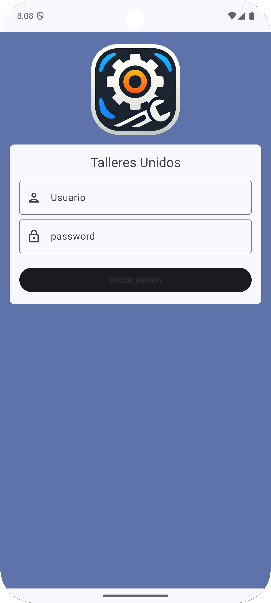
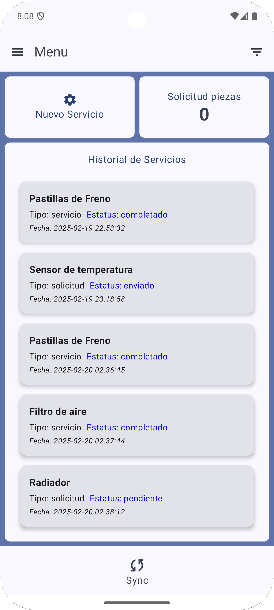
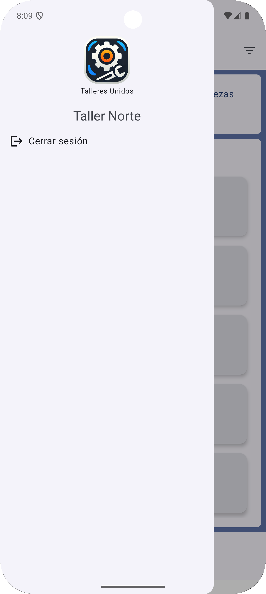
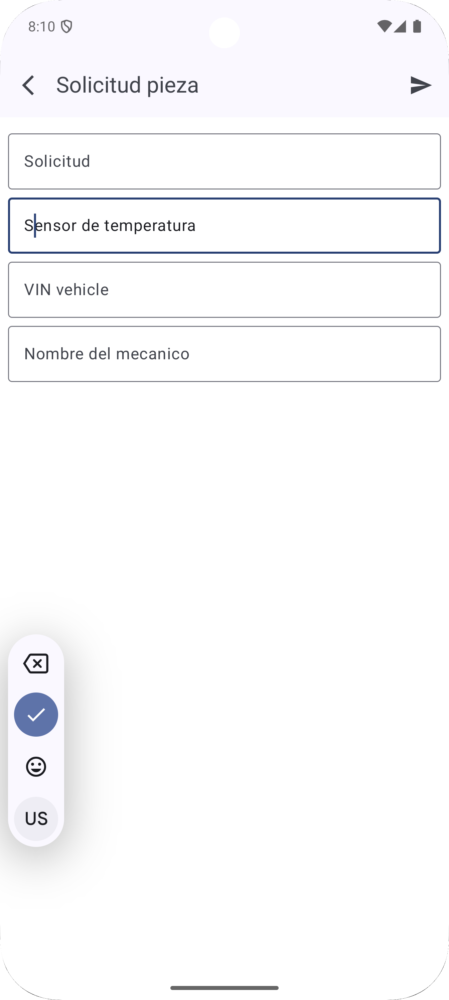
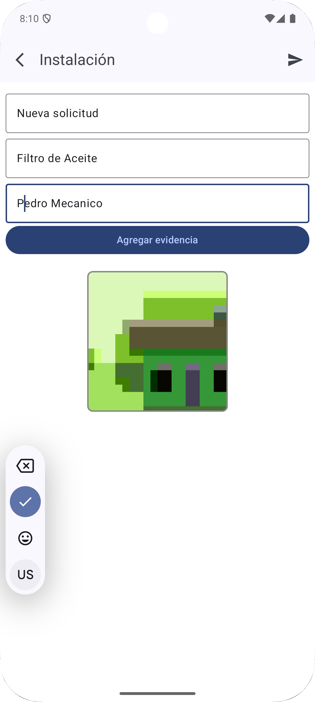
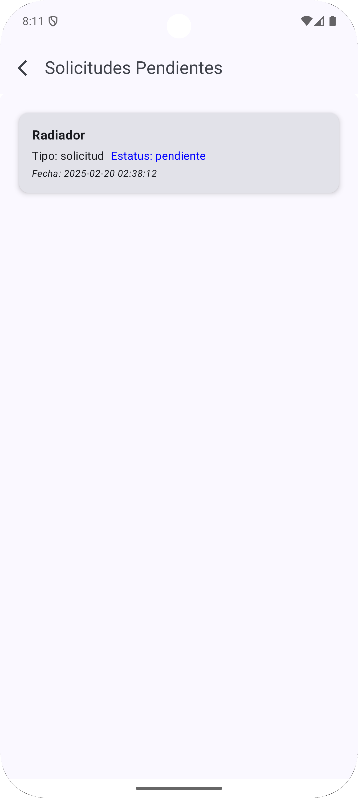
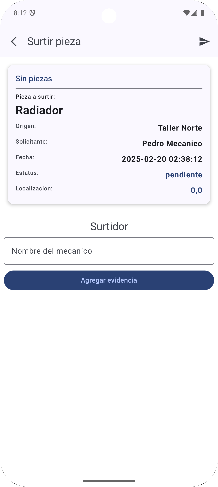
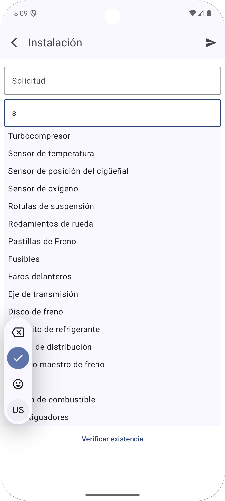

# Talleres Unidos - Aplicación Android

## Autentificacion
Autenticación
La aplicación requiere iniciar sesión para acceder a los flujos principales. Los usuarios de prueba son:

| Usuario       | Contraseña |
| ------------- |:-------------:|
| taller1@gmail.com | 123456 |
| taller2@gmail.com | 123456 |

## Reglas de Negocio
* Un taller que solicita una pieza no puede suplir su propia solicitud.
* Solo un taller distinto al solicitante puede responder y enviar la pieza.
* Se requiere una fotografía de evidencia para registrar la instalación o envío de una pieza.

## Preview White Mode

